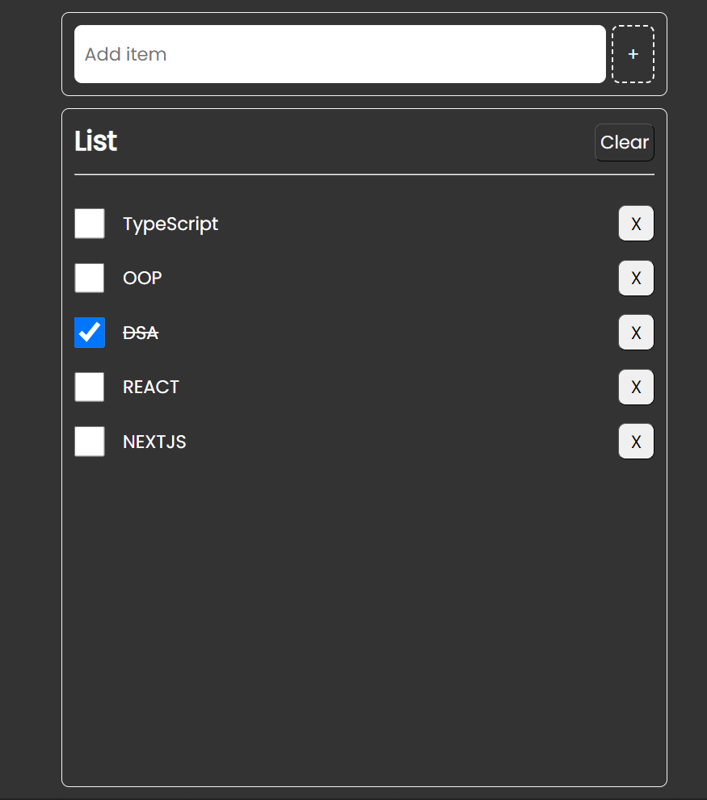

[![Contributors][contributors-shield]][contributors-url]
[![Forks][forks-shield]][forks-url]
[![Stargazers][stars-shield]][stars-url]
[![Issues][issues-shield]][issues-url]
[![MIT License][license-shield]][license-url]
[![LinkedIn][linkedin-shield]][linkedin-url]

<!-- PROJECT LOGO -->

   <h3 align="center">TypeScript TO-DO List</h3>
     
    <a href="https://github.com/arifhossain512/Full-Stack-Clone/issues">Report Bug</a>
    
    
  

<!-- ABOUT THE PROJECT -->
## About The Project

This a  practical project to demonstrate the implementation of Typescript with OOP concept  to create a simple TO-DO app without using anything else.

 Functionality:

* Add Item.
* Delete Item.
* Check a complete Item.
* Clear all the items with one single click. 
* 

This project demonstrate usage of Type implementation in objects, class in constructors, variable, functions and manipulation of DOM with it.

## Built With

This section should list any major frameworks/libraries used to bootstrap your project. Leave any add-ons/plugins for the acknowledgements section. Here are a few examples.

* ![TypeScript][TypeScript]
* ![Vite][Vite]

<!-- LICENSE -->
## License

Distributed under the MIT License. See `LICENSE.txt` for more information.

<!-- CONTACT -->
## Contact

Md. Arif Hossain - [TWITTER](https://twitter.com/arifhossain512) - mdarifhossain512bd@gmail.com

<!-- ACKNOWLEDGMENTS -->
## Acknowledgments

Use this space to list resources you find helpful and would like to give credit to. I've included a few of my favorites to kick things off!

* [Choose an Open Source License](https://choosealicense.com)

<!-- MARKDOWN LINKS  -->

<!-- & IMAGES -->
[product-screenshot]: ./src/public/img/screenshort.png

<!-- GITHUB URLS -->
[linkedin-url]: https://linkedin.com/in/arifhossain512
[license-url]: https://github.com/arifhossain512/Full-Stack-Clone/blob/master/LICENSE.txt
[contributors-url]: https://github.com/arifhossain512/Full-Stack-Clone/graphs/contributors
[forks-url]: https://github.com/arifhossain512/Full-Stack-Clone/network/members
[stars-url]: https://github.com/arifhossain512/Full-Stack-Clone/stargazers
[issues-url]: https://github.com/arifhossain512/Full-Stack-Clone/issues

<!-- BADGES -->

 [contributors-shield]: https://img.shields.io/github/contributors/arifhossain512/Full-Stack-Clone.svg?style=for-the-badge
[forks-shield]: https://img.shields.io/github/forks/arifhossain512/Full-Stack-Clone.svg?style=for-the-badge

[stars-shield]: https://img.shields.io/github/stars/arifhossain512/Full-Stack-Clone.svg?style=for-the-badge

[issues-shield]: https://img.shields.io/github/issues/arifhossain512/Full-Stack-Clone.svg?style=for-the-badge

[license-shield]: https://img.shields.io/github/license/arifhossain512/Full-Stack-Clone.svg?style=for-the-badge

[linkedin-shield]: https://img.shields.io/badge/-LinkedIn-black.svg?style=for-the-badge&logo=linkedin&colorB=555

[Next.js]: https://img.shields.io/badge/next.js-000000?style=for-the-badge&logo=nextdotjs&logoColor=white

<!-- BADGES FOR  TECH STACK -->
[React.js]: https://img.shields.io/badge/React-20232A?style=for-the-badge&logo=react&logoColor=61DAFB
[TypeScript]:https://img.shields.io/badge/TypeScript-20232A?style=for-the-badge&logo=TypeScript
[React-Query]:https://img.shields.io/badge/-React%20Query-20232A?style=for-the-badge&logo=react%20query&logoColor=1572B6
[SASS]:https://img.shields.io/badge/SASS-20232A?style=for-the-badge&logo=SASS&logoColor=1572B6
[Node.js]:https://img.shields.io/badge/Node.js-20232A?style=for-the-badge&logo=node.js
[Express.js]:https://img.shields.io/badge/Express.js-20232A?style=for-the-badge&logo=Express&logoColor=1572B6
[MongoDB]:https://img.shields.io/badge/-MongoDB-20232A?style=for-the-badge&logo=mongodb
[Vue.js]: https://img.shields.io/badge/Vue.js-35495E?style=for-the-badge&logo=vuedotjs&logoColor=4FC08D
[Angular.io]: https://img.shields.io/badge/Angular-DD0031?style=for-the-badge&logo=angular&logoColor=white
[Svelte.dev]: https://img.shields.io/badge/Svelte-4A4A55?style=for-the-badge&logo=svelte&logoColor=FF3E00
[Laravel.com]: https://img.shields.io/badge/Laravel-FF2D20?style=for-the-badge&logo=laravel&logoColor=white
[Bootstrap.com]: https://img.shields.io/badge/Bootstrap-563D7C?style=for-the-badge&logo=bootstrap&logoColor=white
[JQuery.com]: https://img.shields.io/badge/jQuery-0769AD?style=for-the-badge&logo=jquery&logoColor=white
[Vite]:https://img.shields.io/badge/Vite-B73BFE?style=for-the-badge&logo=vite&logoColor=FFD62E

<!-- BADGES WEBSITE -->

[Next-url]: https://nextjs.org/
[React-url]: https://reactjs.org/
[React-Query-url]: https://tanstack.com/
[SASS-url]: https://sass-lang.com/

[Node-url]: https://nodejs.org/

[Express-url]: https://expressjs.com/

[MongoDB-url]: https://www.mongodb.com/
[Vue-url]: https://vuejs.org/

[Angular-url]: https://angular.io/

[Svelte-url]: https://svelte.dev/

[Laravel-url]: https://laravel.com

[Bootstrap-url]: https://getbootstrap.com

[JQuery-url]: https://jquery.com
